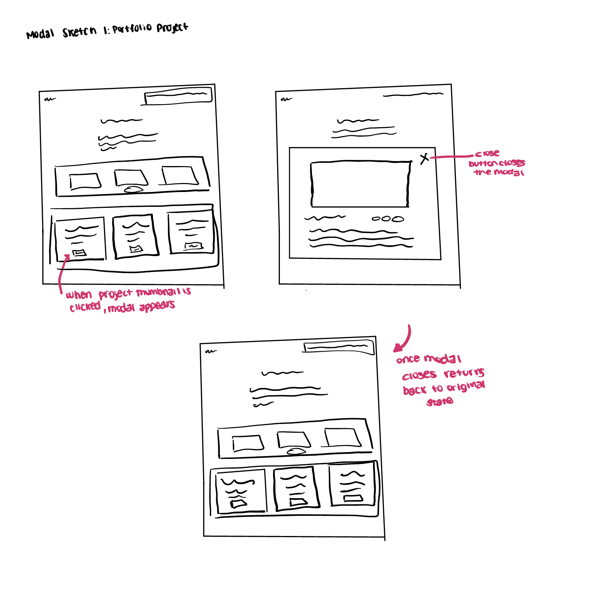
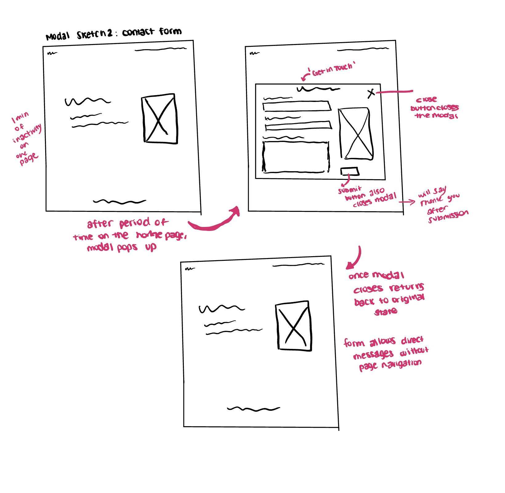
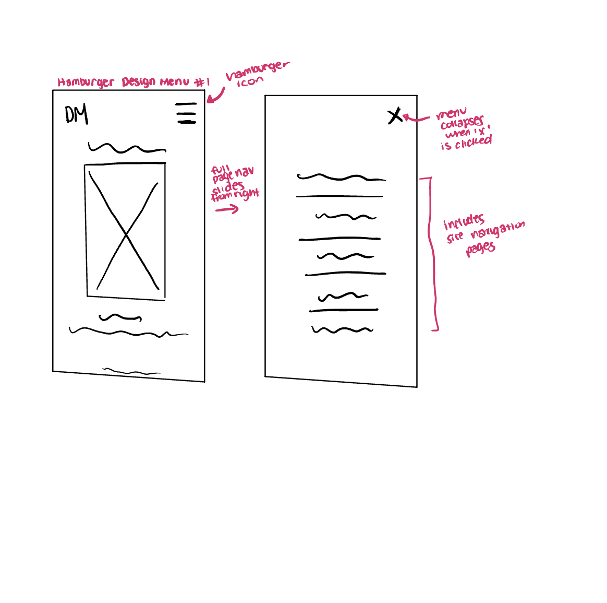
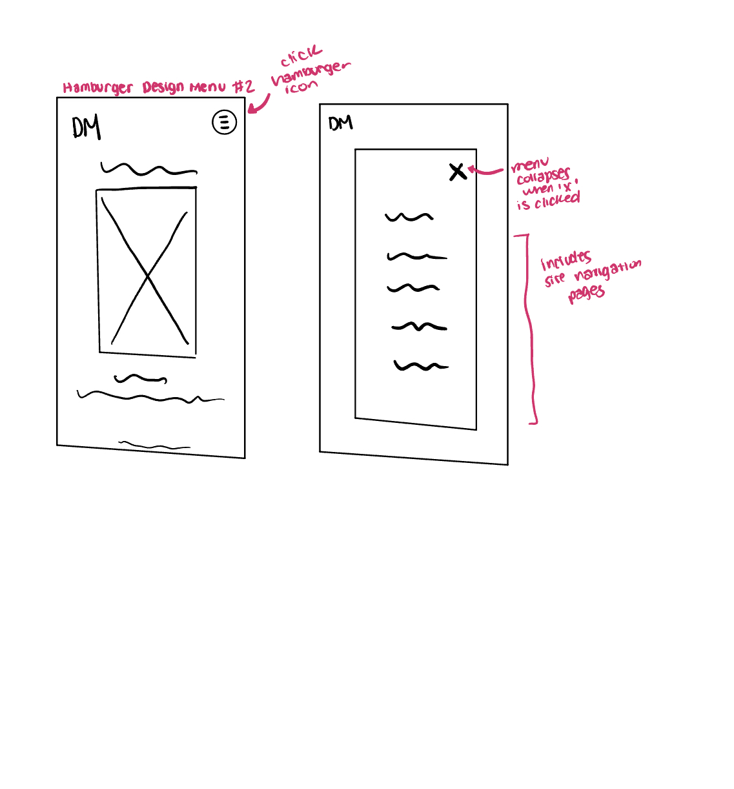
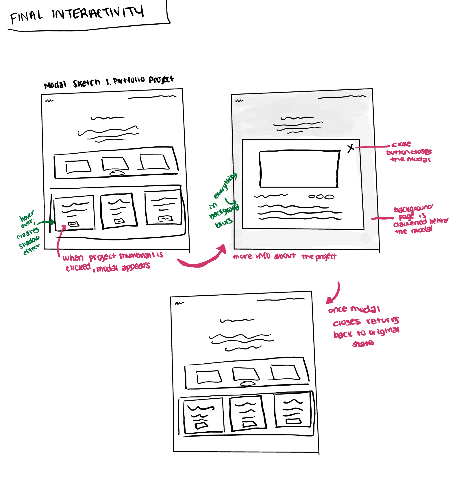
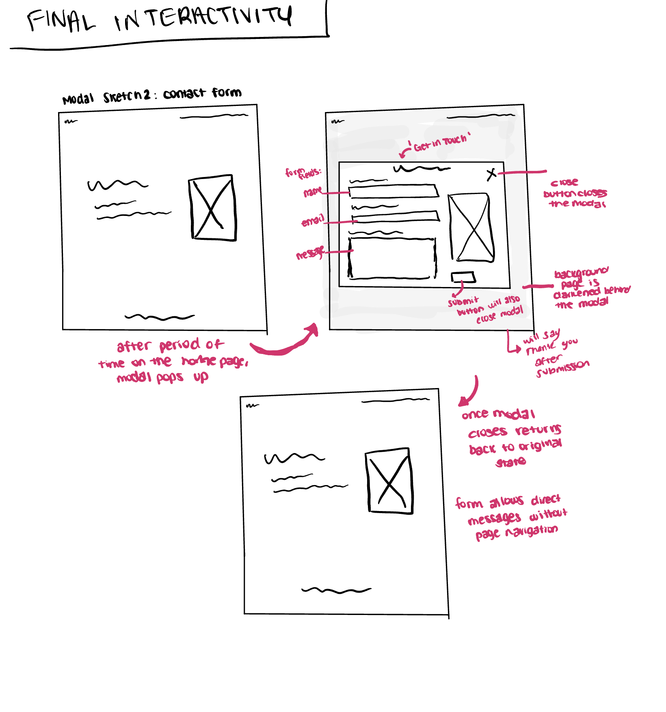
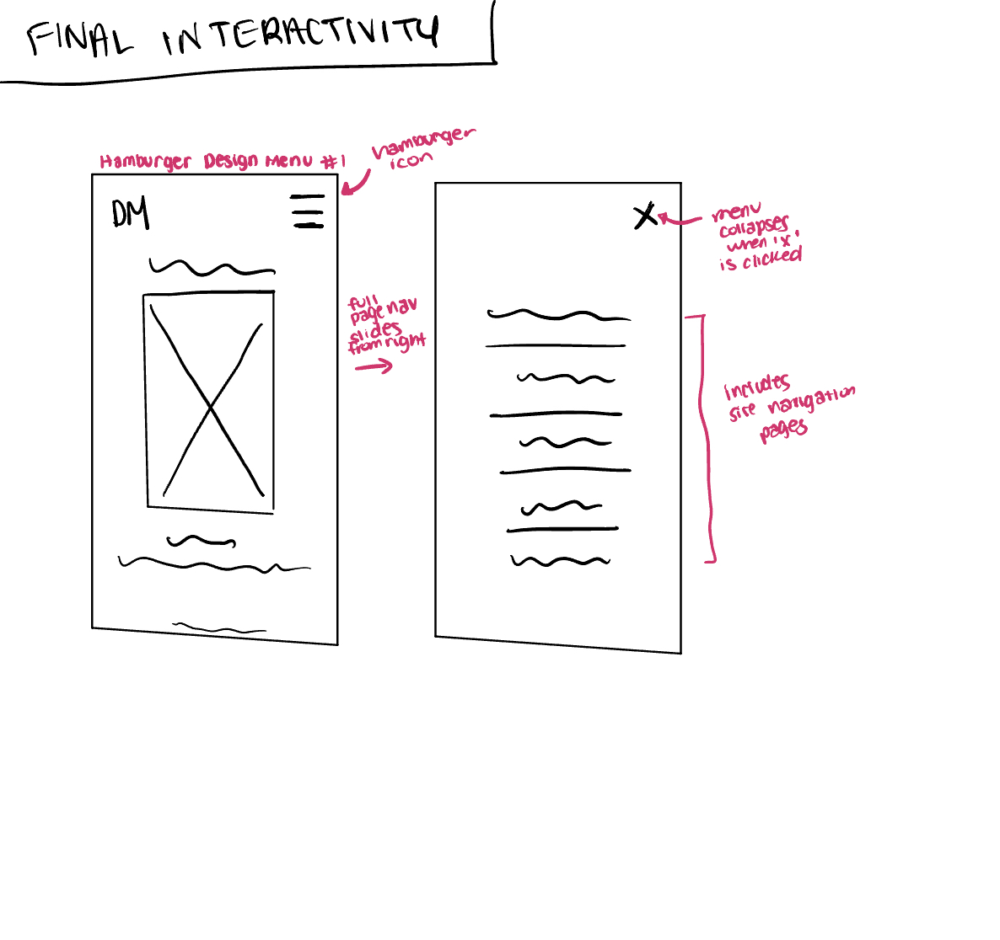
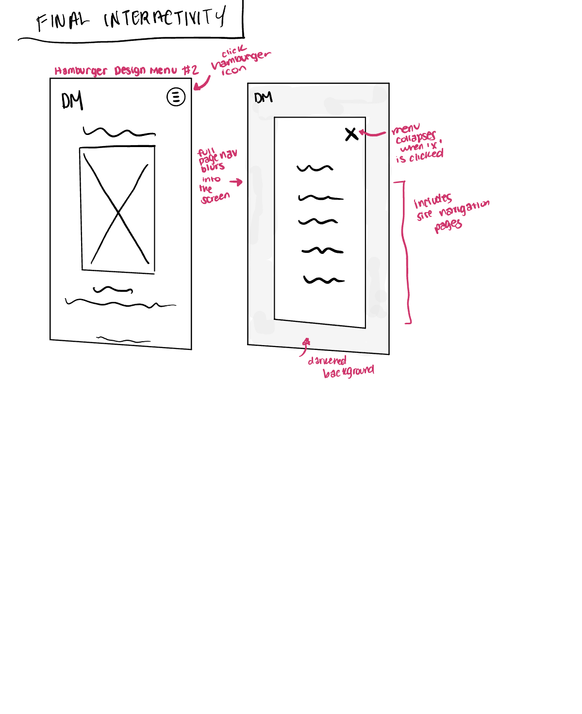
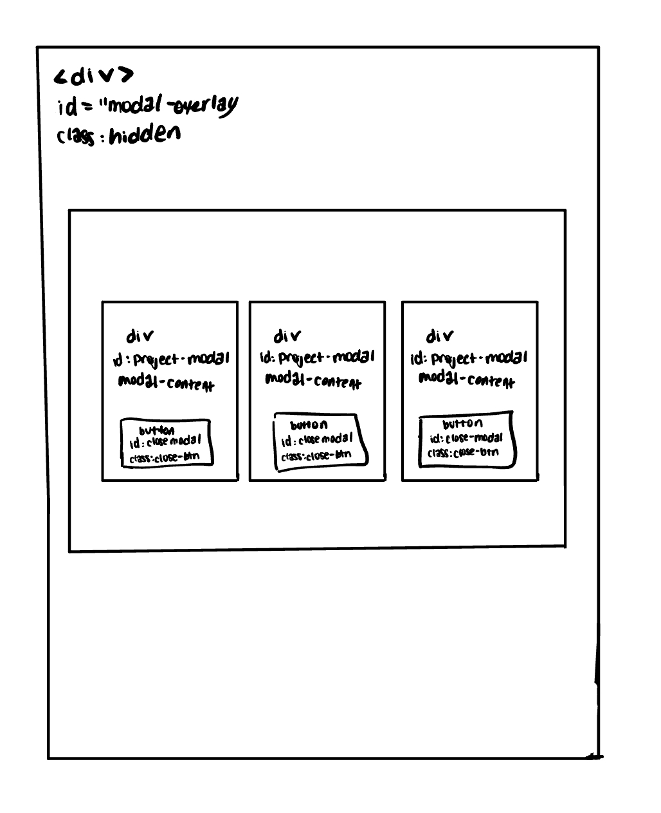
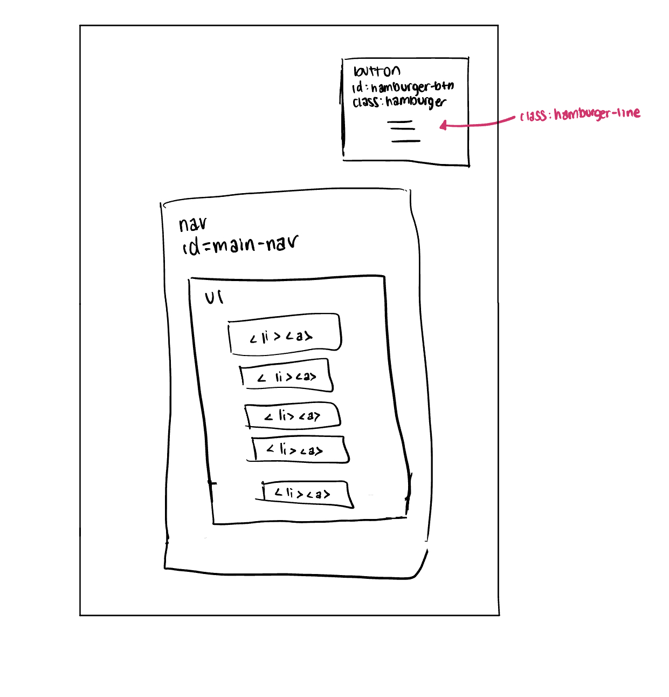

# Project 3, Milestone 1: Design Journey

> **Replace ALL _TODOs_ with your work.** (There should be no TODOs in the final submission.)
>
> Be clear and concise in your writing. Bullets points are encouraged.
>
> Place all design journey images inside the "design-plan" folder and then link them in Markdown so that they are visible in Markdown Preview.
>
> **Everything, including images, must be visible in _Markdown: Open Preview_.** If it's not visible in the Markdown preview, then we can't grade it. We also can't give you partial credit either. **Please make sure your design journey should is easy to read for the grader;** in Markdown preview the question _and_ answer should have a blank line between them.


## Project
> Which project will you add interactivity to enhance the site's functionality?

Project (1)


## Audience's Goals
> List the audience's goals that you identified in Project 1 or 2.
> Simply list each goal. No need to include the "Design Ideas and Choices", etc.
> You may adjust the goals if necessary.

- To learn about my educational background and professional experience
- To view examples of my work and projects
- To understand my skills and expertise
- To find ways to contact me for professional opportunities
- To get a sense of my personality and interests beyond my professional work

## Modal Interactivity Brainstorm
  > Using the audience goals you identified, brainstorm possible options for **modal** interactivity to enhance the functionality of the site while also assisting the audience with their goals.
  > Briefly explain each idea and provide a brief rationale for how the interactivity enhances the site's functionality for the audience. (1 sentence)
> Note: You may find it easier to sketch for brainstorming. That's fine too. Do whatever you need to do to explore your ideas.

- Portfolio Project Modal: When visitors click on a project thumbnail in my portfolio page, a modal will open showing detailed project information, including larger images, my role, technologies used, and outcomes. This enhances the site's functionality by allowing visitors to get in-depth information without navigating away from the portfolio overview.
- Skills Detail Modal: When visitors click on a skill or technology I list on my about page, a modal will display detailed information about my experience with that skill, including projects where I've applied it and my proficiency level. This helps potential employers or collaborators better understand my technical capabilities.
- A "Contact Me" button that opens a modal with a contact form, saving visitors from having to navigate to a separate contact page. This streamlines the process for reaching out to me, making it more likely that visitors will initiate contact.
- A button on my home or about page that opens a modal preview of my full resume/CV, allowing visitors to view my qualifications without downloading a file or navigating away. This provides quick access to my professional credentials.


## Interactivity Design Ideation
> Explore the possible design solutions for the interactivity.
> Sketch at least two iterations of the modal and at least two iterations of the hamburger menu interactivity.
> Annotate each sketch explaining what happens when a user takes an action. (e.g. When user clicks this, something else appears.)
> Do not include HTML/CSS annotations in your sketches!

**MODAL**

]

**HAMBURGER**

]


## Final Interactivity Design Sketches
> Create _polished_ design sketch(es) (it's still a sketch, but with a little more care taken to communicate ideas clearly to the graders) to plan your interactivity.
> **Sketch out the entire page where your interactivity will go.**
> Include your interactivity to the sketch(es).
> Add annotations to explain what happens when the user takes an action.
> Include as many sketches as necessary to communicate your design (ask yourself, could another 1300 take these sketches an implement my design?)

**Modal design sketches:**




**Hamburger drop-down navigation menu design sketches:**





## Interactivity Rationale
> Describe the purpose of your proposed interactivity.
> Provide a brief rationale explaining how your proposed interactivity addresses the goals of your site's audience.
> This should be about a paragraph. (2-3 sentences)

The modal interactivity for portfolio projects enhances my website by allowing visitors to explore detailed information about my work without navigating away from the portfolio overview. This addresses my audience's goal of efficiently viewing my work while maintaining context. The hamburger menu improves usability on mobile devices by providing a clean, space-saving navigation solution that ensures all content remains accessible across different screen sizes, supporting the audience's goal of easily exploring my complete website regardless of their device.


## Interactivity Planning Sketches
> Produce planning sketches that include all the details another 1300 student would need to implement your interactivity design.
> Your planning sketches should include _all_ HTML elements needed for the interactivity; _annotations_ for the element types, their unique IDs, and CSS classes; and lastly the initial CSS classes.
> This is asking you to create a planning sketch like the one we did during the in-class activity.

**Modal planning sketches:**



**Hamburger drop-down navigation menu planning sketches:**




## Interactivity Pseudocode Plan
> Write your interactivity pseudocode plan here.
> Pseudocode is not JavaScript. Do not put JavaScript code here.

**Modal pseudocode:**

> Pseudocode to open the modal:

```
Identify which project was clicked
Find the corresponding modal content
Add class "show-modal" to modal overlay
Add class "show-modal" to the specific modal content
Add class "no-scroll" to body to prevent background scrolling
```

> Pseudocode to close the modal:

```
Remove class "show-modal" from modal overlay
Remove class "show-modal" from all modal content
Remove class "no-scroll" from body to allow scrolling again
```

**Hamburger menu pseudocode:**

> Pseudocode to show/hide (toggle) the navigation menu (narrow screens) when the hamburger button is clicked:

```
if the navigation menu is not visible:
  Add class "show-nav" to the navigation menu
  Add class "active" to hamburger button to transform to X
else:
  Remove class "show-nav" from the navigation menu
  Remove class "active" from hamburger button to return to hamburger icon
```

> Media queries are prohibited to show/hide the hamburger menu for this assignment.
> (I want you to demonstrate the interactivity learning objectives we covered in class.)
> If the browser window is narrow when the page loads, the hamburger button should be visible and the navigation should be hidden.
> If the browser window is wide when the page loads, the hamburger menu should not be visible.
> Complete the pseudocode to show/hide (toggle) the navigation on page load:

```
if window width is less than 768px:
  Add class "hidden" to navigation menu
  Add class "visible" to hamburger button
else if window width is 768px or greater:
  Remove class "hidden" from navigation menu
  Add class "hidden" to hamburger button

```

> If the browser window is resized from wide to narrow, the hamburger menu should become visible and the navigation should be hidden.
> If the browser window is resized from narrow to wide, the hamburger menu should become hidden and the navigation should be visible.

```
if window width is less than 768px:
  Add class "hidden" to navigation menu
  Add class "visible" to hamburger button
else if window width is 768px or greater:
  Remove class "hidden" from navigation menu
  Add class "hidden" to hamburger button
```


## References

### Collaborators
> List any persons you collaborated with on this project.

No one.


### Reference Resources
> Did you use any resources not provided by this class to help you complete this assignment?
> List any external resources you referenced in the creation of your project. (i.e. W3Schools, StackOverflow, Mozilla, etc.)
>
> List **all** resources you used (websites, articles, books, etc.), including generative AI.
> Provide the URL to the resources you used and include a short description of how you used each resource.

(https://developer.mozilla.org/en-US/docs/Web/CSS/z-index) : Used to understand how to properly layer the modal overlay and

(https://developer.mozilla.org/en-US/docs/Web/API/Window/resize_event) : Used to understand the window resize event for responsive hamburger menu
